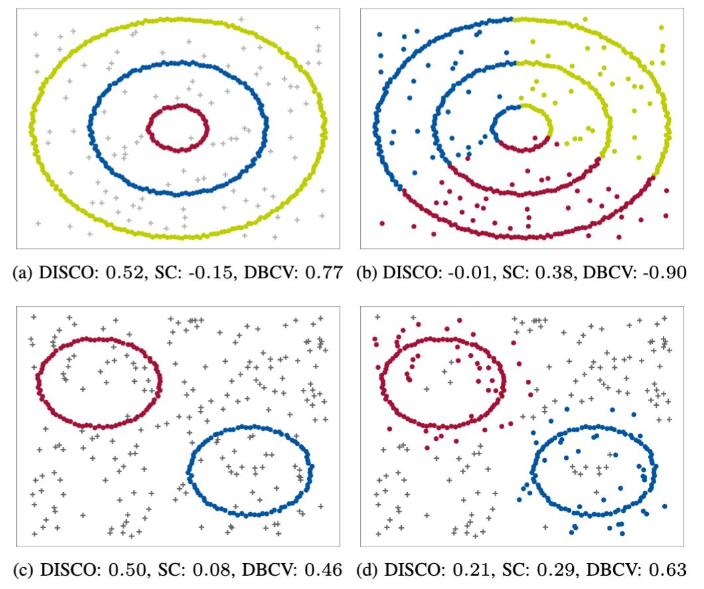
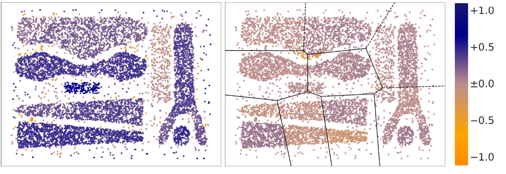
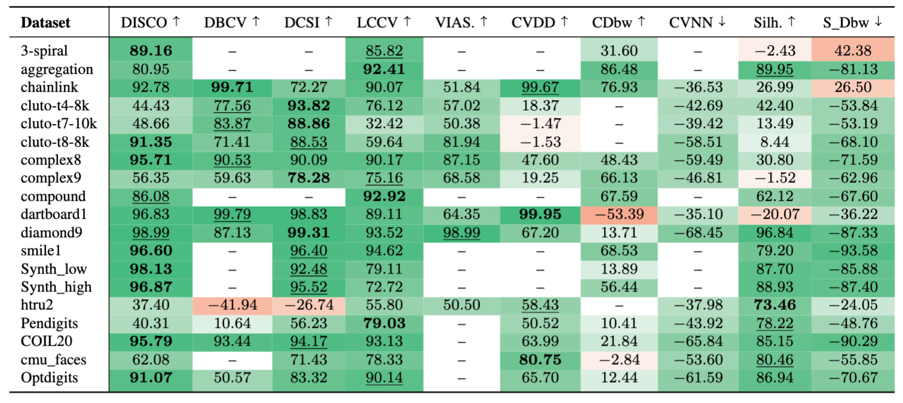

# DISCO: DISCO: Internal Evaluation of Density-Based Clustering with Noise Labels

This repository is the official implementation of DISCO: Internal Evaluation of Density-Based Clustering with Noise Labels, submitted to [IEEE ICDM 2025](https://www3.cs.stonybrook.edu/~icdm2025/index.html).


## Motivational Figure



Notebook to generate this can be found [here](src/Experiments/JupyterNotebooks_SyntheticExperiments/Table3.ipynb).

## DISCO - Score
[DISCO](src/Evaluation/disco.py) is designed on a pointwise level:

The code used to generate these examples can be found [here](src/Experiments/JupyterNotebooks_SyntheticExperiments/Pointwise.ipynb).
## Results
Internal CVIs should reflect what external CVIs, like ARI, indicate when the ground truth is given. 
To assess this, we regard the Pearson Correlation Coefficient (PCC) between the CVI scores and the ARI values across various common clusterings. 
The shown PCC indicates the correlation between the CVIs given in the columns for the datasets given in the rows. 
As some edge cases, e.g., singleton clusters, are not defined for some CVIs, the PCC cannot always be computed (stated with --).

The scripts used to generate the results can be found [here](src/Experiments/scripts).
## Structure of the repository
Our repository is structured as follows:
```bash
.
│
├── data                                    # dataset infos
│
├── datasets  
│   ├── DENSIRED                            # data generator
│   ├── synth                               # synthetic data
│   └── ...                                 # file to provide access to data
│
├── imgs                                    # image files (plots, figures)
│   └── ...         
│              
├── src
│   ├── Clusterer                           # implementations for clustering methods
│   ├── Evaluation                          # implementations of CVIs
│   ├── Experiments                         # experiment scripts
│   │   ├── DatasetsJupyterNotebooks                    # datasets
│   │   ├── JupyterNotebooks_Analysis                   # notebooks to analyse datasets
│   │   ├── JupyterNotebooks_SyntheticExperiments       # notebooks to generate experiment results
│   │   ├── scripts                                     # additional experiments
│   │   └── ...
│   ├── utils                               # colors, metrics, utility functions 
│   ├── __init__.py                         # init file
│   └── __setup.ipynb                       # notebook for setup
│ 
├── .gitignore                              # ignore files should not commit to Git
└── README.md                               # project description  
```


## Experimental Setup
We performed an ablation study to assess the sensitivity of DISCO regarding its only hyperparameter $\mu$:


The experiments for the ablation study can be found [here](src/Experiments/JupyterNotebooks_SyntheticExperiments/Ablation_Experiment.ipynb). We set our hyperparameter to $\mu$=5 across all experiments.
### Parameter settings
| Method  | Hyperparameter                  | Value | 
|---------|---------------------------------|-------|
| CDBW    | number of representative points | 10    | 
| CVDD    | number of neighborhoods         | 7     |
| CVNN    | number of nearest neighbors     | 10    | 
| DCSI    | corepoints                      | 5     | 
|---------|---------------------------------|-------|
| DISCO   | min pts                         | 5     |
|---------|---------------------------------|-------|
